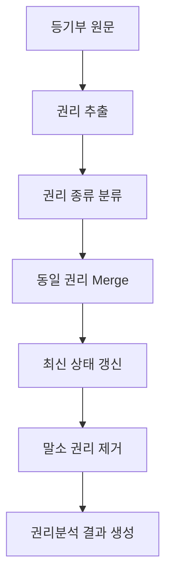

# 등기부등본 데이터 파싱
- 등기부등본 데이터는 단순 row 저장만으로는 현재 유효한 권리 상태를 재현하기 어려움.
- 동일 권리가 설정 → 변경 → 이전 → 경정 과정을 거치며 여러 건으로 기록됨.
- 등기부 비정형 데이터를 구조화하여 현재 시점의 권리 상태를 자동 재구성하는 권리분석 엔진을 구현한 사례.

## 등기부등본 예시
순위 1 근저당권설정 > 순위 1 근저당권변경 > 순위 1 근저당권이전 > 순위 1 근저당권경정
- 4개의 데이터로 보이나 실제 의미는 1개의 권리가 상태 변경.

## Key Achievements
- 동일 권리 추적
- 최신 상태 유지
- 말소 권리 자동 제외
- 재처리 가능 구조 유지
- 현재 유효 권리 재구성
- 데이터 정합성

## Architecture

## Business logic
- 순위번호 + 등기목적을 기준으로 동일 권리를 추적.
- 변경,이전,경정 발생시 기존 권리 엔티티를 유지하고 최신 상태로 overwrite.
- 등기목적 문자열 기반 Rule Engine 구현(예시)
  - 근저당권설정 → 근저당권
  - 가압류 → 가압류
  - 압류 → 압류
  - 전세권설정 → 전세권
- 임차권 정보는 비정형 문자열 형태로 존재.
  - 정규표현식을 활용하여(임차인,보증금,차임,전입일자) 데이터 추출 및 구조화

## 등기부등본 파싱으로 얻어지는 효과
- 단순 row 저장 방식에서 벗어나 실제 현재 시점 기준의 권리 상태를 자동 재구성할 수 있는 구조를 구축
- 이를 기반으로 권리분석 서비스,특수조건(선순위 권리 판단), 인수 권리 분석 기능(예상배당)에 활용
